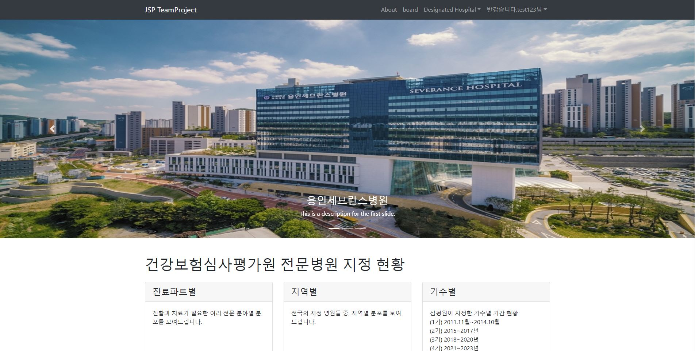
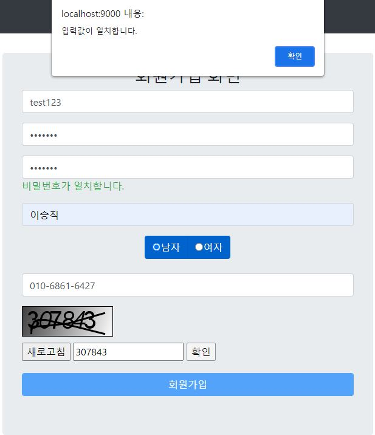
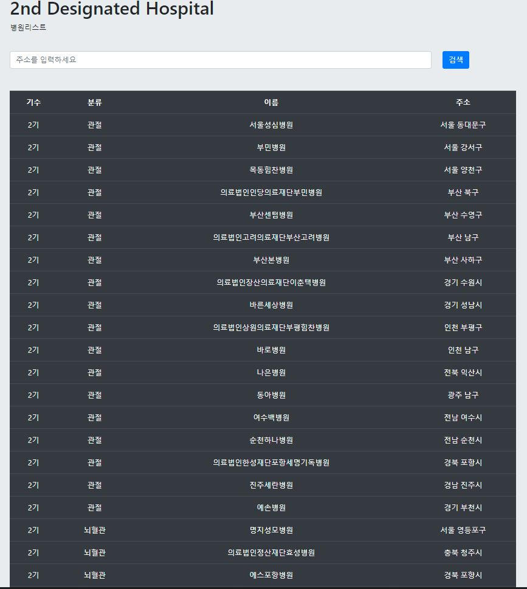
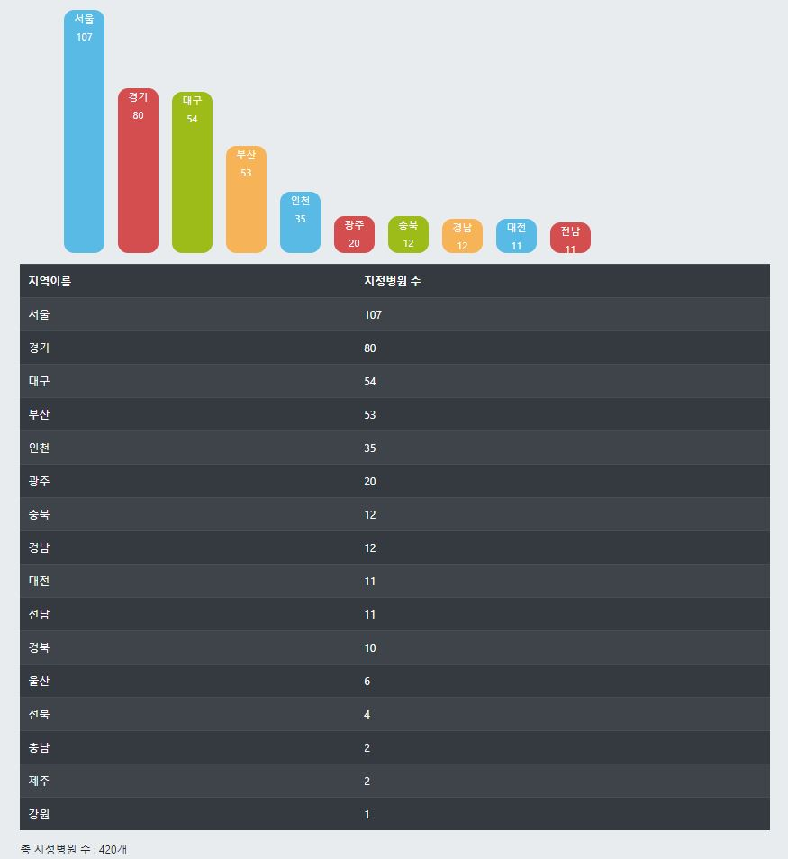
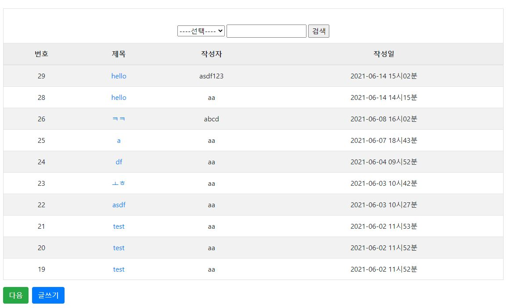

# <JSP 프로젝트>
이 저장소는 JSP와 공공데이터를 사용한 전문지정병원 프로젝트를 저장한 곳입니다.
- JSP는 Eclipse에서 사용한 환경에서 진행하였습니다.
- Python은 PyCharm을 사용한 환경에서 진행하였습니다.
- DataBase는 MySQL를 사용한 환경에서 진행하였습니다.   

## 소개
- JSP
    - 기본 홈페이지 구현
    - 회원가입시 Chaptcha 이용하여 자동가입방지 구현
    - 로그인 전 네비바 숨김 / 로그인 후 네비바 표시
    - DB에 저장한 데이터 사용
    - D3.js를 사용한 그래프 구현
    - 게시판(글쓰기, 글 삭제, 글 수정) 및 댓글 구현
    - 전문지정병원 리스트 및 검색기능을 통한 리스트 필터링 구현
    - 전문지정 기수에 따른 기수별 리스트 구현
- Python
    - 공공데이터 api를 이용해 데이터 크롤링
    - 크롤링한 데이터 분석
    - 분석한 데이터 DB에 저장
- Database : MySQL
    - MySQL Workbench를 활용하여 DB 관리
